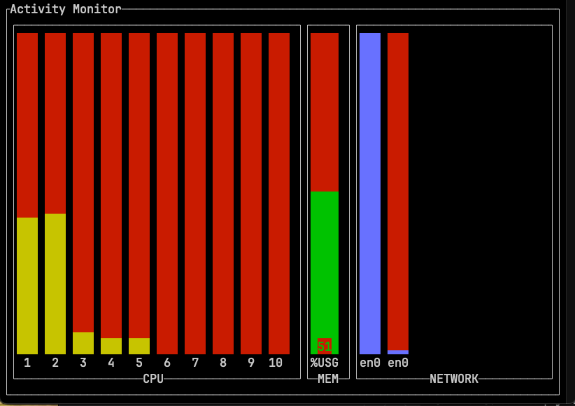

# activity-monitor-rs

A simple and limited activity monitor for the terminal.
Created just for practicing Rust and checking out the `ratatui` crate, and therefore is far from complete, and not meant to be so.

Feel free to use it if it fits your needs, and also to fork it, in case you wish to make something more usable out of it.

## Screenshot

## Running in dev mode

Run `cargo run` or `cargo watch -x run` (if you have `cargo-watch`).

## Building

Run `cargo build --release`